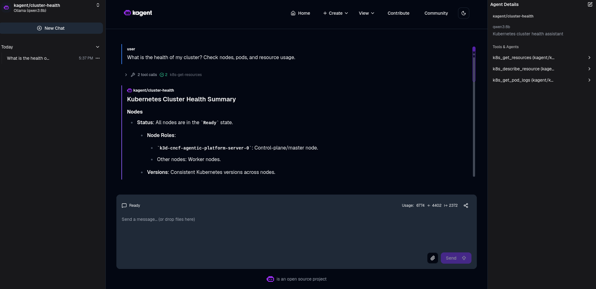
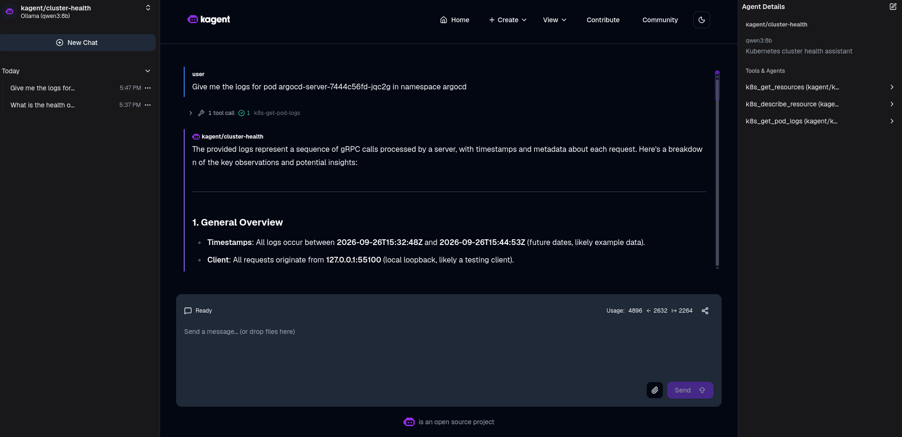

# cncf-agentic-platform

> Building an Agentic Internal Developer Platform with CNCF projects on k3d.

Personal Platform Engineering lab demonstrating how to design, operate, and
observe an Internal Developer Platform (IDP) built **exclusively on CNCF
projects**, with a focus on **AI agents as first-class workloads**.

> **Disclaimer** — This is a personal project. It is not affiliated with,
> endorsed by, or sponsored by the CNCF, the Linux Foundation, or any of the
> projects it references.

## Goals

- Provision a local Kubernetes cluster with **k3d**.
- Bootstrap a GitOps-driven platform using **CNCF projects only**.
- Deliver observability, security, and networking as platform primitives.
- Run **AI agents** on Kubernetes (starting with **kagent**, CNCF Sandbox).
- Explore CNCF Sandbox projects related to agentic AI workloads.

## Status

Operational. k3d, GitOps, observability, and kagent are running.

## Demo





## Architecture

```text
┌─────────────────────────────────────────────────────────────┐
│                        Developer                            │
└──────────────────────────┬──────────────────────────────────┘
                           │
                     GitOps (Argo CD)
                           │
┌──────────────────────────▼──────────────────────────────────┐
│                  k3d Kubernetes cluster                     │
│                                                             │
│  ┌────────────┐  ┌────────────┐  ┌────────────┐             │
│  │ Networking │  │ Security   │  │ Observ.    │             │
│  └────────────┘  └────────────┘  └────────────┘             │
│                                                             │
│  ┌────────────────────────────────────────────┐             │
│  │            AI Agent Runtime                │             │
│  │              (kagent)                      │             │
│  └────────────────────────────────────────────┘             │
└─────────────────────────────────────────────────────────────┘
```

## Prerequisites

- Docker (or a compatible container runtime)
- k3d
- kubectl
- helm
- make

## Quickstart

```bash
make cluster-up        # create local k3d cluster
make argocd-install    # install Argo CD via Helm
make gitops-bootstrap  # hand over control to Argo CD
make gitops-status     # verify apps are Synced / Healthy
```

UIs:

- Argo CD: [argocd.localhost:8080](http://argocd.localhost:8080) — password via `make argocd-password`
- Grafana: [grafana.localhost:8080](http://grafana.localhost:8080) — `admin` / `prom-operator`
- kagent: [kagent.localhost:8080](http://kagent.localhost:8080)

Run `make help` for all targets.

## Repository layout

| Path         | Purpose                                           |
| ------------ | ------------------------------------------------- |
| `bootstrap/` | One-time bootstrap (k3d cluster, Argo CD, Ollama) |
| `gitops/`    | Argo CD Applications                              |
| `platform/`  | Platform component values                         |
| `agents/`    | AI agent definitions and workloads                |
| `docs/adr/`  | Architecture Decision Records                     |

## Roadmap

- [x] Scaffold repository
- [x] Local k3d cluster up/down
- [x] GitOps bootstrap with Argo CD
- [x] Observability stack
- [x] kagent deployment
- [x] First agent use case
- [ ] Security baseline
- [ ] Networking baseline
- [ ] Agent-to-agent workflow
- [ ] Documentation and demos

## AI Transparency

This project is developed with AI assistance. All AI-generated content is
reviewed, tested, and validated by a human before commit. The author is
responsible for the final content.

## License

Code is licensed under the [Apache 2.0 license](LICENSE).

Documentation is licensed under a [CC-BY-4.0 license](LICENSE-docs).
